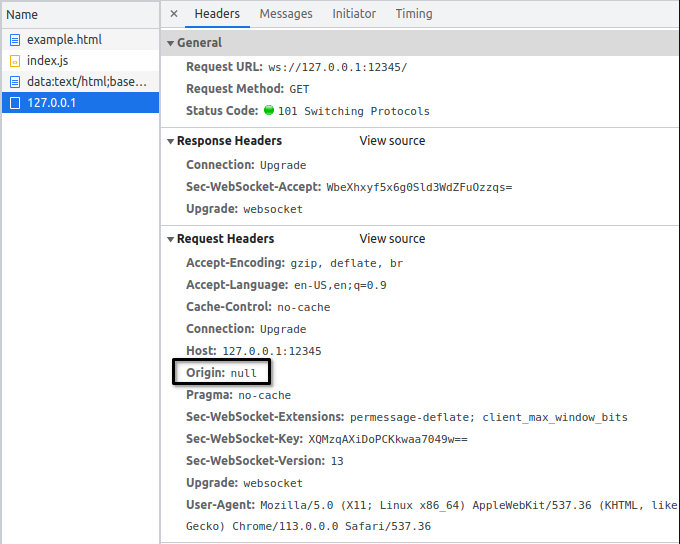

# Null Origin WebSocket

The purpose of this library is to permit the creation of a **WebSocket client** with header **Origin null**.



# TODO and improvements
- documentation
- ~~make npm package~~
- typescript example

# Usage using npm

```
npm install null-origin-websocket
```

# Brief theory behind the functioning of the library

The library, under the hood, uses an **HTML iframe** which content is a **Javascript WebSocket Base64 encoded**.

**The trick of using Base64 encoding for the WebSocket, is the key to get the header Origin equals to null.**

Communication between the WebSocket inside the iframe and the "outside world" (and vice versa) is done through the use of the **Javascript postMessage** function.

For more specific details and implementations, the source code of the library can be consulted (at the moment it's very small code base, so not difficult to find what you need to know). 

# Define a custom Null Origin WebSocket client

The library is made with the purpose to simplify the creation of a **custom Null Origin WebSocket client** by simply extending a class.

The class that must be extended is: `AbstractNullOriginWebSocket`

The `SimpleNullOriginWebSocket` is an example of custom WebSocket client created by extending the `AbstractNullOriginWebSocket`. It is already present in the library and it can be used for simple use cases.

For a client with advanced features, it is recommended to extend `AbstractNullOriginWebSocket` and implements the methods with the custom logics.

# Local development

A ready to use local development env is present in `dev` folder.

In the `index.ts` there is the declaration of a WebSocket client based on `SimpleNullOriginWebSocketClient`.

In the `ws-server.js` there is a basic WebSocket server that can be used to test the client defined in `index.ts`.

In order to run the local development env:
```bash
# From project root folder, run webpack local http server:
npn run serve

# From dev folder, run WebSocket server:
node run ws-server.js

# After WebSocket server correctly started, the following message should appear:

The WebSocket server is running on port 12345

# Open browser on localhost:8080

# Check console/network tab of browser
```
Then you are able to make changes on code inside `src` folder and see the changes in console/network browser.

Note that `index.ts` inside `dev` folder is only for testing/development purpose.
The library `index.ts`, that exposes the library classes, is the one inside `src`.

# Build the library

Tools needed:
- Git
- NodeJS: v18.16.0 (tested only with this version)

To make a local build of the library:
``` bash
# Clone repository locally

# From terminal, enter in the root folder of the cloned repository

# Install dependencies
npm install

# Run the build command
npm run build:lib
```

A `lib` folder will be created with the result of the build

# Library usage through npm package

If the library is installed through the npm package command, just import it from `node_modules`.

Then follow **Local build library usage example** (changing the path accordingly) for the usage.

# Local build library usage example Typescript

Here the steps to use a build of the library in a Typescript project

- make a build of the library (see **Build the library** section)

- copy the resulting `lib` folder in the folder/project where you need to use the **Null Origin WebSocket** client

- `import { ... } from "null-origin-websocket";` in typescript file

- do what you need

Here an example of `SimpleNullOriginWebSocket` usage in typescript file:
```typescript
import { SimpleNullOriginWebSocketClient } from "null-origin-websocket";

const client: SimpleNullOriginWebSocketClient = new SimpleNullOriginWebSocketClient("ws://127.0.0.1:12345");

await client.establishWebSocketConnection();

```
Here a definition of a custom Null Origin WebSocket client (called `MyNullOriginWebSocketClient`) extending the `AbstractNullOriginWebSocketClient`:
```typescript

import { AbstractNullOriginWebSocketClient } from "null-origin-websocket";

class MyNullOriginWebSocketClient extends AbstractNullOriginWebSocketClient {
    // Implement all abstract methods and logics here
}
```
# Local build library usage example Javascript

Here the steps to use a build of the library in HTML file:

- make a build of the library (see **Build the library** section)

- copy the resulting `lib` folder in the folder/project where you need to use the **Null Origin WebSocket** client

- import `lib/umd/index.js` in HTML file

- do what you need

Here an example of `SimpleNullOriginWebSocket` usage in HTML file:
```html
<!DOCTYPE html>
<html lang="en">
<head>
    <meta charset="UTF-8">
    <meta http-equiv="X-UA-Compatible" content="IE=edge">
    <meta name="viewport" content="width=device-width, initial-scale=1.0">
    <title>SimpleNullOriginWebSocketClient</title>
</head>
<body>
    <script src="./lib/umd/index.js"></script>
    <script>
(async ()=>{
    const webSocketServerUrl = "ws://127.0.0.1:12345";
    const client = 
        new NullOriginWebSocket.SimpleNullOriginWebSocketClient(webSocketServerUrl);

    client.setCustomOnMessageCallback(
        (response)=>{
            console.log("Handling response from custom handler");
            console.log(response);
        }
    );
    
    await client.establishWebSocketConnection();
})();
        
    </script>
    
</body>
</html>

```

Here a definition of a custom Null Origin WebSocket client (called `MyNullOriginWebSocketClient`) extending the `AbstractNullOriginWebSocketClient`:
```html
<!DOCTYPE html>
<html lang="en">
<head>
    <meta charset="UTF-8">
    <meta http-equiv="X-UA-Compatible" content="IE=edge">
    <meta name="viewport" content="width=device-width, initial-scale=1.0">
    <title>MyNullOriginWebSocketClient</title>
</head>
<body>
    <script src="./lib/umd/index.js"></script>
    <script>
(async ()=>{
    class MyNullOriginWebSocketClient extends NullOriginWebSocket.AbstractNullOriginWebSocketClient {
        onopenCallback(response) {
            console.log("onopen");
            console.log(response);
            if (this.customOnOpenCallback) {
                this.customOnOpenCallback(response);
            }
            else {
                console.warn("No custom callback defined for onopen event");
            }
        }
        onmessageCallback(response) {
            console.log("onmessage");
            console.log(response);
            if (this.customOnMessageCallback) {
                this.customOnMessageCallback(response);
            }
            else {
                console.warn("No custom callback defined for onmessage event");
            }
        }
        onerrorCallback(response) {
            console.log("onerror");
            console.log(response);
            if (this.customOnErrorCallback) {
                this.customOnErrorCallback(response);
            }
            else {
                console.warn("No custom callback defined for onerror event");
            }
        }
        oncloseCallback(response) {
            console.log("onclose");
            console.log(response);
            if (this.customOnCloseCallback) {
                this.customOnCloseCallback(response);
            }
            else {
                console.warn("No custom callback defined for onclose event");
            }
        }
        constructor(url) {
            super(url);
        }
        setCustomOnOpenCallback(callback) {
            this.customOnOpenCallback = callback;
        }
        setCustomOnMessageCallback(callback) {
            this.customOnMessageCallback = callback;
        }
        setCustomOnErrorCallback(callback) {
            this.customOnErrorCallback = callback;
        }
        setCustomOnCloseCallback(callback) {
            this.customOnCloseCallback = callback;
        }
    }
    
    const webSocketServerUrl = "ws://127.0.0.1:12345";
    const client = new MyNullOriginWebSocketClient(webSocketServerUrl);
    // Set here custom callback if needed
    client.setCustomOnMessageCallback(
        (response)=>{
            console.log("Handling response from custom handler");
            console.log(response);
        }
    );
    await client.establishWebSocketConnection();
})();

    </script>

</body>
</html>
```
